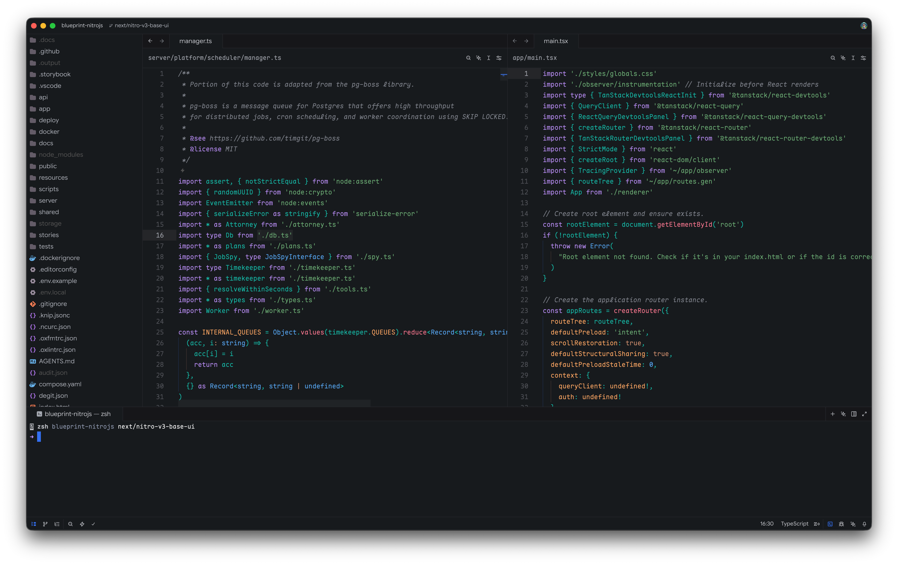
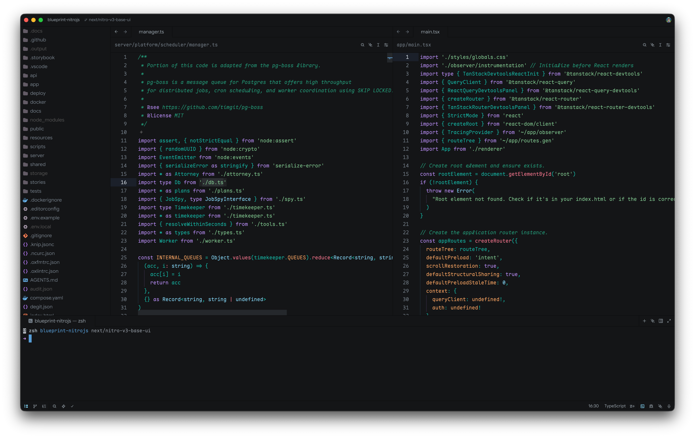
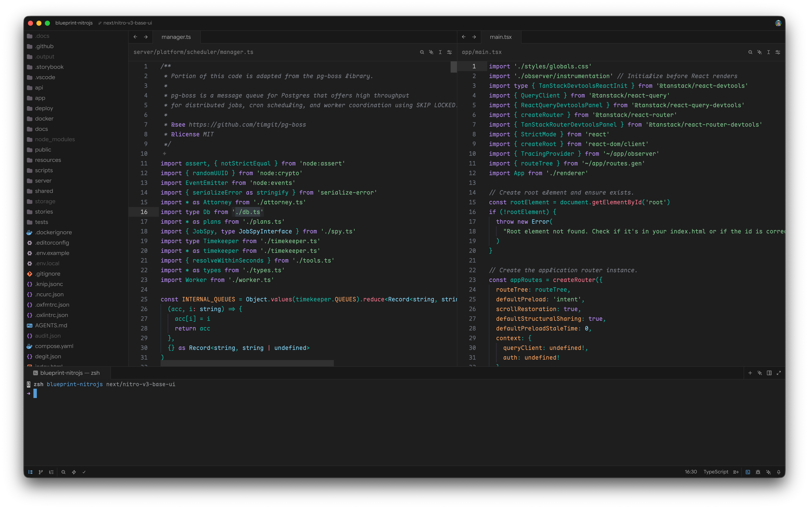
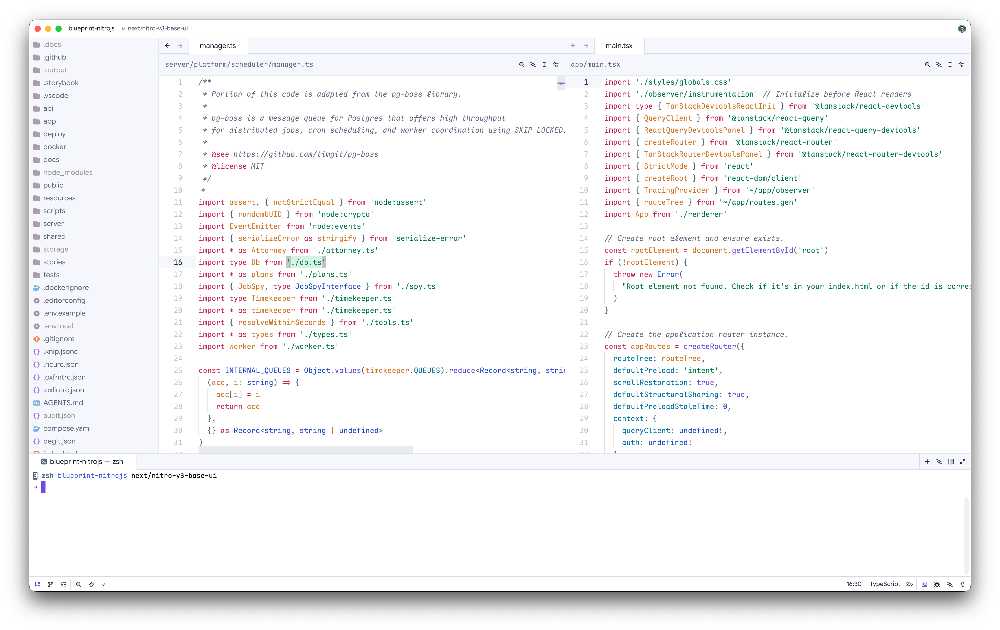

# Atomizer Theme for Zed

A custom color theme for [Zed](https://zed.dev/), the high-performance, collaborative code editor.

## Theme Variants

| Theme                  | Description                         |
|------------------------|-------------------------------------|
| `atomizer-dark`        | Dark theme with high contrast       |
| `atomizer-dark-island` | Dark theme with softer, muted tones |
| `atomizer-light`       | Light theme for daytime use         |
| `atomizer-soft`        | Soft, low-contrast dark theme       |

## Screenshots

### Atomizer Dark Island

### Atomizer Dark

### Atomizer Soft

### Atomizer Light

## License

This project is open-sourced software licensed under the [MIT license](./LICENSE).
